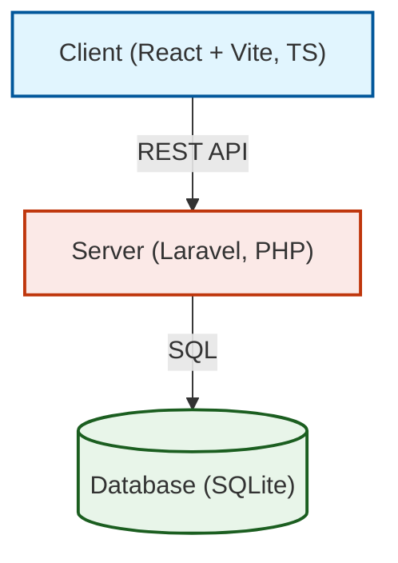
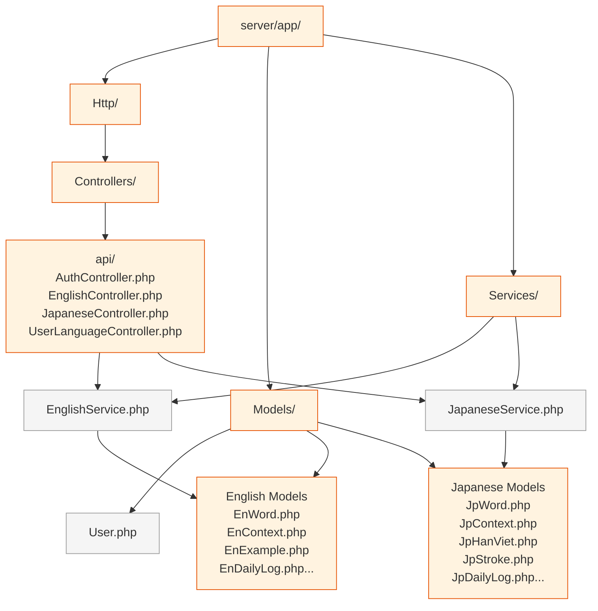
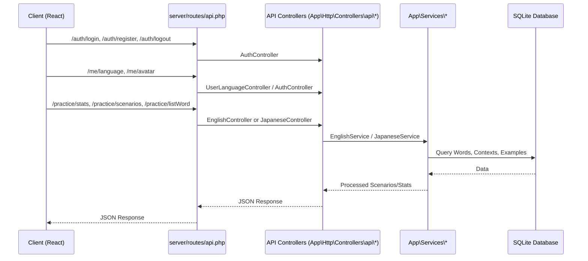

# ProjectWEb - Agent Instructions & Architecture Map

Welcome! You are operating in the **ProjectWEb** repository. This document provides the repository's architectural map, system behaviors, and guidelines for using the GitNexus Code Intelligence tools.

## 1. High-Level System Architecture

The project follows a standard decoupled Client-Server architecture. The frontend is built with React/Vite (TypeScript), and the backend uses Laravel (PHP) with a SQLite database.

## 2. Frontend Map (Client)

The React client contains specific modules for different language practices (Japanese, English), centralized state management and component structures.

```mermaid
flowchart TD
    classDef dir fill:#fff3e0,stroke:#e65100,stroke-width:1px;
    classDef file fill:#f5f5f5,stroke:#9e9e9e,stroke-width:1px;
    
    Src[src/]:::dir
    
    Main[main.tsx]:::file
    App[App.tsx]:::file
    ApiClient[apiClient.tsx]:::file
    
    Src --> Main
    Src --> App
    Src --> ApiClient
    
    App --> Routes[routes/]:::dir
    App --> Components[components/]:::dir
    App --> English[english/]:::dir
    App --> Japanese[japanese/]:::dir
    App --> Services[services/]:::dir
    
    %% Routes details
    Routes --> RouteComponents[components/\nAppShell.tsx\nLoadingScreen.tsx\nNotFound.tsx]:::dir
    Routes --> LanguageRoutes[language-routes/\nenRoutes.tsx\njpRoutes.tsx]:::dir
    Routes --> AppRoutes[AppRoutes.tsx]:::file
    Routes --> ProtectedRoute[ProtectedRoute.tsx]:::file
    
    %% Common Components
    Components --> Header[Header.tsx]:::file
    Components --> Chat[Chat/]:::dir
    
    %% Japanese Module
    Japanese --> JpPages[pages/\nGrammarPracticePage.tsx\nWordPracticePage.tsx]:::dir
    Japanese --> JpPractice[practice/\nMultipleChoice...\nReadingHiragana...\nTypingRomaji...\nVoicePractice...\nWritingKanji...]:::dir
    Japanese --> JpComponents[components/\nVocabularyTable.tsx\nPracticeLayout.tsx\n...]:::dir
    Japanese --> JpForms[forms/\nEditWordForm.tsx\n...]:::dir
    Japanese --> JpUtils[utils/\nusePracticeStore.ts\nkanjiStrokeData.ts\npracticeConfig.ts]:::dir
    
    %% English Module
    English --> EnPages[pages/\nGrammarPracticePage.tsx\nWordPracticePage.tsx]:::dir
    English --> EnPractice[practice/\nFillInBlank...\nMultipleChoice...\nSentenceCompletion...\nVoicePractice...]:::dir
    English --> EnComponents[components/\nVocabularyTable.tsx\nPracticeSummary.tsx\n...]:::dir
    English --> EnForms[forms/\nEditWordForm.tsx\n...]:::dir
    English --> EnUtils[utils/\nusePracticeStore.ts\npracticeConfig.ts]:::dir
    
    %% Services
    Services --> ChatService[ChatService.ts]:::file
```

### English & Japanese Module Structure

The client is clearly divided into two language domains, each implementing a consistent pattern: `pages` orchestrate the view, `components` & `forms` build the UI elements, `practice` contains specific interactive exercises, and `utils` manage local state (using what appear to be custom hooks or Zustand stores, via `usePracticeStore.ts`).

## 3. Backend Map (Server)

The Laravel backend exposes API endpoints and manages entity interactions for language practices.

## 4. API Route Mappings

All client interactions hit the standard `/server/routes/api.php`, mapping into the controllers.

## 5. Database Schema & Migrations

The SQLite database (`server/database/database.sqlite`) uses migrations located in `server/database/migrations`.

Key entities include:
*   **Users & Auth:** `users`, `password_reset_tokens`, `personal_access_tokens`, `sessions`
*   **English domain:** `en_words`, `en_examples`, `en_contexts`, `en_example_exercises`, `en_exercise_choices`, `en_daily_logs`
*   **Japanese domain:** `jp_words`, `jp_examples`, `jp_contexts`, `jp_han_viets`, `jp_strokes`, `jp_example_exercises`, `jp_exercise_choices`, `jp_daily_logs`
*   **System/Admin:** `cache`, `failed_jobs`, `jobs`

## GitNexus Analysis Guidelines

This project is indexed. You have access to GitNexus MCP tools. 
- ALWAYS run `gitnexus_query` to understand new domains.
- ALWAYS use `gitnexus_impact` before modifying code blocks, especially for shared `Services` (Backend) or `components/utils` (Client).
- Verify state updates using the traces: e.g. `READ gitnexus://repo/ProjectWEb/process/Update → GetBaseWaitSeconds`.

> Re-run `npx gitnexus analyze` after significant file creation to keep the architecture map in your tools updated.
