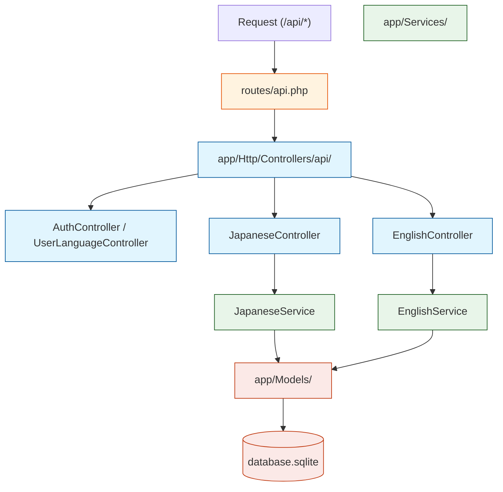

# ProjectWEb - Server (Backend) Agent Instructions

Welcome! You are operating in the **Backend (Server)** of the ProjectWEb repository. This document outlines the application domains, structural flow, and conventions for the Laravel matching API layer.

## 1. Laravel Architecture Overview

This server is standard Laravel (PHP) acting entirely as an API hub, backed by a localized SQLite database (`database/database.sqlite`). 

## 2. Models & Data Architecture

The data scheme strictly limits cross-contamination between English and Japanese study models.

*   **Users & State:** `User.php`, Session info.
*   **Japanese Entity Domain:**
    *   `JpWord`: Core vocabulary item containing lapses/streaks.
    *   `JpHanViet`, `JpStroke`, `JpContext`, `JpExample`: Extended descriptors and media data.
    *   `JpExampleExercise`, `JpExerciseChoice`: Specific structure templates for testing.
*   **English Entity Domain:**
    *   `EnWord`: Core vocabulary item. Contains `is_grammar` distinctions.
    *   `EnContext`, `EnExample`, `EnExampleExercise`, `EnExerciseChoice`.

*Note: Migrations dictate the exact structural requirements. Do not assume properties match exactly between `EnWord` and `JpWord`.*

## 3. Required Agent Behaviors

1.  **Strict MVC Pattern:** 
    *   **Controllers** ONLY format requests, apply middleware logic, and return serialized JSON. 
    *   **NO business logic in routes or controllers.**
    *   **Services** (`EnglishService.php`, `JapaneseService.php`) MUST handle all heavy logic, querying algorithms, and spaced-repetition statistical evaluations (streak/lapse calculation).
2.  **Database Precautions:** It uses SQLite. Use standard Laravel Eloquent ORM relationships at all times. Do not write raw SQL queries spanning disparate models.
3.  **Route Mapping check:** Before appending new functions to a controller, ensure an associated route is added/secured in `routes/api.php`.
4.  **Testing Blast Radius:** Modifying `JapaneseService.php` or `EnglishService.php` will immediately reflect across all matching Practice Components on the Frontend. Always evaluate the return payload shape (`shape_check`) to ensure the Frontend matches exactly.
