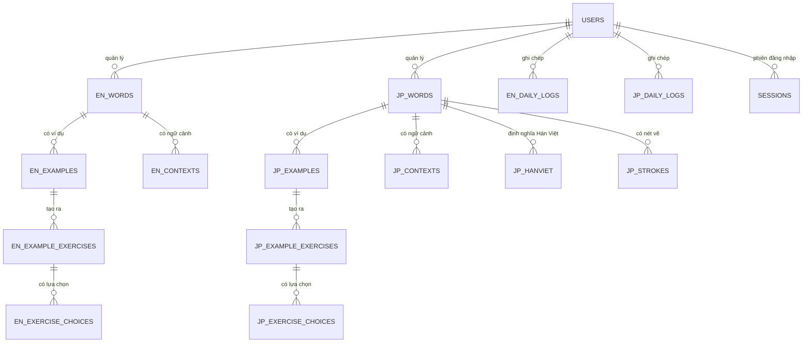

# Tài liệu Kiến trúc Cơ sở Dữ liệu MochiApp

Tài liệu này mô tả chi tiết toàn bộ cấu trúc cơ sở dữ liệu SQLite của dự án **MochiApp**, bao gồm các bảng học tập tiếng Anh (EN), tiếng Nhật (JP), thông tin người dùng và các bảng quản trị hệ thống của Laravel.

---

## 📊 Sơ đồ Quan hệ Thực thể (ERD)

Dưới đây là sơ đồ quan hệ giữa các thực thể chính trong hệ thống MochiApp:

---

## 👤 Phân hệ Người dùng & Hệ thống

### 1. Bảng `users`
Lưu trữ thông tin tài khoản người dùng tham gia ứng dụng.

| Tên cột | Kiểu dữ liệu | Thuộc tính | Mô tả |
| :--- | :--- | :--- | :--- |
| `id` | unsigned big int | **PK**, Auto Increment | ID định danh người dùng |
| `name` | string | Not Null | Tên người dùng |
| `email` | string | Not Null, **Unique** | Địa chỉ email đăng nhập |
| `password` | string | Not Null | Mật khẩu (đã mã hóa) |
| `avatar_url` | string | Nullable | Đường dẫn ảnh đại diện |
| `role` | string | Default: `'user'` | Quyền hạn: `user` \| `admin` |
| `learning_language` | string | Default: `'en'` | Ngôn ngữ đang học: `en` \| `jp` |
| `remember_token` | string | Nullable | Token ghi nhớ đăng nhập |
| `created_at` | timestamp | Nullable | Thời gian tạo tài khoản |
| `updated_at` | timestamp | Nullable | Thời gian cập nhật gần nhất |

---

## 🇬🇧 Phân hệ Học tập Tiếng Anh (EN)

### 2. Bảng `en_words`
Lưu trữ danh sách các từ vựng tiếng Anh cần học (theo thuật toán Spaced Repetition).

| Tên cột | Kiểu dữ liệu | Thuộc tính | Mô tả |
| :--- | :--- | :--- | :--- |
| `id` | unsigned big int | **PK**, Auto Increment | ID định danh từ vựng |
| `user_id` | unsigned big int | **FK** -> `users.id` (cascade) | ID người sở hữu từ vựng |
| `word` | string | Not Null | Từ tiếng Anh |
| `ipa` | string | Nullable | Phiên âm quốc tế (IPA) |
| `meaning_vi` | text | Nullable | Nghĩa tiếng Việt |
| `cefr_level` | string | Nullable | Trình độ khung CEFR (A1–C2) |
| `level` | integer | Nullable | Cấp độ học hiện tại |
| `last_reviewed_at`| timestamp | Nullable | Thời gian ôn tập gần nhất |
| `next_review_at` | timestamp | Nullable | Thời gian ôn tập tiếp theo |
| `exampleEn` | string | Nullable | Câu ví dụ tiếng Anh đi kèm từ |
| `exampleVn` | string | Nullable | Dịch nghĩa câu ví dụ |
| `is_active` | boolean | Default: `true` | Trạng thái kích hoạt học |
| `is_grammar` | boolean | Default: `false` | Đánh dấu nếu là cấu trúc ngữ pháp |
| `topic` | json | Nullable | Chủ đề của từ vựng (dạng danh sách JSON) |
| `lapses` | integer | Default: `0` | Số lần quên từ (trả lời sai) |
| `streak` | integer | Default: `0` | Chuỗi số lần trả lời đúng liên tiếp |
| `created_at` | timestamp | Nullable | Thời gian thêm từ |
| `updated_at` | timestamp | Nullable | Thời gian cập nhật |

### 3. Bảng `en_examples`
Các câu ví dụ mở rộng giúp làm rõ nghĩa và cách dùng của từ tiếng Anh.

| Tên cột | Kiểu dữ liệu | Thuộc tính | Mô tả |
| :--- | :--- | :--- | :--- |
| `id` | unsigned big int | **PK**, Auto Increment | ID câu ví dụ |
| `en_word_id` | unsigned big int | **FK** -> `en_words.id` (cascade) | Liên kết tới từ vựng tiếng Anh |
| `sentence_en` | text | Not Null | Câu ví dụ bằng tiếng Anh |
| `sentence_vi` | text | Nullable | Bản dịch câu ví dụ |
| `created_at` | timestamp | Nullable | Thời gian tạo |
| `updated_at` | timestamp | Nullable | Thời gian cập nhật |

### 4. Bảng `en_contexts`
Bổ sung ngữ cảnh sử dụng cho các từ vựng tiếng Anh.

| Tên cột | Kiểu dữ liệu | Thuộc tính | Mô tả |
| :--- | :--- | :--- | :--- |
| `id` | unsigned big int | **PK**, Auto Increment | ID ngữ cảnh |
| `en_word_id` | unsigned big int | **FK** -> `en_words.id` (cascade) | Liên kết tới từ vựng |
| `context_vi` | text | Nullable | Mô tả ngữ cảnh bằng tiếng Việt |
| `created_at` | timestamp | Nullable | Thời gian tạo |
| `updated_at` | timestamp | Nullable | Thời gian cập nhật |

### 5. Bảng `en_example_exercises`
Các câu hỏi/bài tập trắc nghiệm hoặc điền vào chỗ trống sinh ra từ câu ví dụ tiếng Anh.

| Tên cột | Kiểu dữ liệu | Thuộc tính | Mô tả |
| :--- | :--- | :--- | :--- |
| `id` | unsigned big int | **PK**, Auto Increment | ID bài tập |
| `example_id` | unsigned big int | **FK** -> `en_examples.id` (cascade) | Liên kết tới câu ví dụ gốc |
| `question_type` | string | Not Null | Dạng bài tập (`multiple_choice` \| `fill_in_blank`) |
| `question_text` | text | Nullable | Nội dung câu hỏi |
| `blank_position`| integer | Nullable | Vị trí chèn ô trống (dùng cho điền chỗ trống) |
| `answer_explanation`| text | Nullable | Giải thích đáp án chi tiết |
| `created_at` | timestamp | Nullable | Thời gian tạo |
| `updated_at` | timestamp | Nullable | Thời gian cập nhật |

### 6. Bảng `en_exercise_choices`
Các đáp án/lựa chọn tương ứng cho bài tập tiếng Anh.

| Tên cột | Kiểu dữ liệu | Thuộc tính | Mô tả |
| :--- | :--- | :--- | :--- |
| `id` | unsigned big int | **PK**, Auto Increment | ID lựa chọn |
| `exercise_id` | unsigned big int | **FK** -> `en_example_exercises.id` (cascade) | Liên kết tới câu hỏi |
| `content` | text | Not Null | Nội dung phương án trả lời |
| `is_correct` | boolean | Default: `false` | Đánh dấu phương án đúng |
| `created_at` | timestamp | Nullable | Thời gian tạo |
| `updated_at` | timestamp | Nullable | Thời gian cập nhật |

### 7. Bảng `en_daily_logs`
Nhật ký ghi nhận lịch trình ôn tập tiếng Anh mỗi ngày của người dùng để tính streak học tập tổng thể.

| Tên cột | Kiểu dữ liệu | Thuộc tính | Mô tả |
| :--- | :--- | :--- | :--- |
| `id` | unsigned big int | **PK**, Auto Increment | ID bản ghi |
| `user_id` | unsigned big int | **FK** -> `users.id` (cascade) | Liên kết tới người dùng |
| `reviewed_at` | date | Not Null | Ngày ghi nhận ôn tập |
| `status` | boolean | Default: `false` | Trạng thái hoàn thành mục tiêu ngày |
| `created_at` | timestamp | Nullable | Thời gian tạo |
| `updated_at` | timestamp | Nullable | Thời gian cập nhật |

* Ràng buộc duy nhất (Unique): `['user_id', 'reviewed_at']` (Tránh trùng lặp log trong cùng 1 ngày của 1 user).

---

## 🇯🇵 Phân hệ Học tập Tiếng Nhật (JP)

### 8. Bảng `jp_words`
Lưu trữ danh sách các từ vựng tiếng Nhật (Kanji/Kana) cần ôn tập (Spaced Repetition).

| Tên cột | Kiểu dữ liệu | Thuộc tính | Mô tả |
| :--- | :--- | :--- | :--- |
| `id` | unsigned big int | **PK**, Auto Increment | ID định danh từ vựng |
| `user_id` | unsigned big int | **FK** -> `users.id` (cascade) | ID người học |
| `kanji` | string | Not Null | Từ vựng bằng chữ Hán Nhật (Kanji) |
| `reading_hiragana`| string | Nullable | Cách đọc bằng Hiragana/Katakana |
| `reading_romaji` | string | Nullable | Cách đọc phiên âm Romaji |
| `meaning_vi` | text | Nullable | Nghĩa tiếng Việt |
| `jlpt_level` | string | Nullable | Trình độ JLPT tương ứng (N5–N1) |
| `level` | integer | Nullable | Cấp độ nhớ hiện tại |
| `last_reviewed_at`| timestamp | Nullable | Thời gian ôn tập gần nhất |
| `next_review_at` | timestamp | Nullable | Thời gian ôn tập tiếp theo |
| `audio_url` | string | Nullable | Đường dẫn file phát âm tiếng Nhật |
| `is_grammar` | boolean | Default: `false` | Đánh dấu cấu trúc ngữ pháp |
| `is_active` | boolean | Default: `false` | Trạng thái đang học |
| `topic` | json | Nullable | Danh mục/chủ đề từ vựng |
| `lapses` | integer | Default: `0` | Số lần quên từ |
| `last_quiz_type`| string | Nullable | Loại bài trắc nghiệm gần nhất sử dụng |
| `streak` | integer | Default: `0` | Chuỗi trả lời đúng liên tiếp |
| `created_at` | timestamp | Nullable | Thời gian thêm từ |
| `updated_at` | timestamp | Nullable | Thời gian cập nhật |

### 9. Bảng `jp_examples`
Các câu ví dụ ngữ cảnh mở rộng cho từ vựng tiếng Nhật.

| Tên cột | Kiểu dữ liệu | Thuộc tính | Mô tả |
| :--- | :--- | :--- | :--- |
| `id` | unsigned big int | **PK**, Auto Increment | ID câu ví dụ |
| `jp_word_id` | unsigned big int | **FK** -> `jp_words.id` (cascade) | Liên kết tới từ vựng |
| `sentence_jp` | text | Not Null | Câu ví dụ bằng tiếng Nhật |
| `sentence_hira` | text | Nullable | Phiên âm câu ví dụ bằng Hiragana |
| `sentence_romaji`| text | Nullable | Phiên âm câu ví dụ bằng Romaji |
| `sentence_vi` | text | Nullable | Bản dịch nghĩa tiếng Việt |
| `created_at` | timestamp | Nullable | Thời gian tạo |
| `updated_at` | timestamp | Nullable | Thời gian cập nhật |

### 10. Bảng `jp_contexts`
Ngữ cảnh mô tả của từ tiếng Nhật.

| Tên cột | Kiểu dữ liệu | Thuộc tính | Mô tả |
| :--- | :--- | :--- | :--- |
| `id` | unsigned big int | **PK**, Auto Increment | ID ngữ cảnh |
| `jp_word_id` | unsigned big int | **FK** -> `jp_words.id` (cascade) | Liên kết tới từ vựng |
| `context_vi` | text | Nullable | Nội dung ngữ cảnh bằng tiếng Việt |
| `created_at` | timestamp | Nullable | Thời gian tạo |
| `updated_at` | timestamp | Nullable | Thời gian cập nhật |

### 11. Bảng `jp_hanviet`
Lưu thông tin âm Hán Việt và giải thích chi tiết Hán tự của từ tiếng Nhật.

| Tên cột | Kiểu dữ liệu | Thuộc tính | Mô tả |
| :--- | :--- | :--- | :--- |
| `id` | unsigned big int | **PK**, Auto Increment | ID định danh |
| `jp_word_id` | unsigned big int | **FK** -> `jp_words.id` (cascade) | Liên kết tới từ vựng Kanji |
| `han_viet` | string | Nullable | Phiên âm Hán-Việt |
| `explanation` | text | Nullable | Chiết tự hoặc giải nghĩa chi tiết chữ Hán |
| `created_at` | timestamp | Nullable | Thời gian tạo |
| `updated_at` | timestamp | Nullable | Thời gian cập nhật |

### 12. Bảng `jp_strokes`
Lưu đường dẫn ảnh SVG/PNG minh họa động hướng dẫn viết các nét chữ Hán (Stroke Order).

| Tên cột | Kiểu dữ liệu | Thuộc tính | Mô tả |
| :--- | :--- | :--- | :--- |
| `id` | unsigned big int | **PK**, Auto Increment | ID định danh |
| `jp_word_id` | unsigned big int | **FK** -> `jp_words.id` (cascade) | Liên kết tới từ vựng |
| `stroke_url` | string | Nullable | URL ảnh/vector các nét vẽ viết chữ Kanji |
| `created_at` | timestamp | Nullable | Thời gian tạo |
| `updated_at` | timestamp | Nullable | Thời gian cập nhật |

### 13. Bảng `jp_example_exercises`
Bảng câu hỏi được thiết kế từ các câu ví dụ tiếng Nhật.

| Tên cột | Kiểu dữ liệu | Thuộc tính | Mô tả |
| :--- | :--- | :--- | :--- |
| `id` | unsigned big int | **PK**, Auto Increment | ID bài tập |
| `example_id` | unsigned big int | **FK** -> `jp_examples.id` (cascade) | Liên kết tới câu ví dụ |
| `question_type` | string | Not Null | Dạng bài (`multiple_choice` \| `fill_in_blank` \| `kanji_write`) |
| `question_text` | text | Nullable | Đề bài câu hỏi |
| `blank_position`| integer | Nullable | Vị trí chèn khoảng trống câu điền từ |
| `answer_explanation`| text | Nullable | Phần hướng dẫn giải chi tiết |
| `created_at` | timestamp | Nullable | Thời gian tạo |
| `updated_at` | timestamp | Nullable | Thời gian cập nhật |

### 14. Bảng `jp_exercise_choices`
Phương án lựa chọn đi kèm với câu hỏi bài tập tiếng Nhật.

| Tên cột | Kiểu dữ liệu | Thuộc tính | Mô tả |
| :--- | :--- | :--- | :--- |
| `id` | unsigned big int | **PK**, Auto Increment | ID phương án |
| `exercise_id` | unsigned big int | **FK** -> `jp_example_exercises.id` (cascade) | Liên kết tới câu hỏi |
| `content` | text | Not Null | Nội dung đáp án lựa chọn |
| `is_correct` | boolean | Default: `false` | Xác định phương án đúng |
| `created_at` | timestamp | Nullable | Thời gian tạo |
| `updated_at` | timestamp | Nullable | Thời gian cập nhật |

### 15. Bảng `jp_daily_logs`
Ghi chép thông số học tập tiếng Nhật mỗi ngày của học viên.

| Tên cột | Kiểu dữ liệu | Thuộc tính | Mô tả |
| :--- | :--- | :--- | :--- |
| `id` | unsigned big int | **PK**, Auto Increment | ID bản ghi |
| `user_id` | unsigned big int | **FK** -> `users.id` (cascade) | Liên kết tới người dùng |
| `reviewed_at` | date | Not Null | Ngày học |
| `status` | boolean | Default: `false` | Đánh giá hoàn thành mục tiêu ngày |
| `created_at` | timestamp | Nullable | Thời gian tạo |
| `updated_at` | timestamp | Nullable | Thời gian cập nhật |

* Ràng buộc duy nhất (Unique): `['user_id', 'reviewed_at']`

---

## 🛠️ Các Bảng Quản trị & Hệ thống (Laravel Standard)

Dưới đây là thông số của các bảng phụ trợ được tự động tạo và vận hành bởi Laravel Framework.

### 16. Bảng `cache` & `cache_locks`
Quản lý bộ nhớ đệm (Cache) của ứng dụng để tối ưu hóa truy xuất.

- **Bảng `cache`**:
  * `key` (string, **Primary Key**): Khóa cache
  * `value` (mediumText): Giá trị lưu trữ
  * `expiration` (integer): Thời gian hết hạn (Unix timestamp)

- **Bảng `cache_locks`**:
  * `key` (string, **Primary Key**): Khóa khóa tiến trình
  * `owner` (string): Tiến trình sở hữu khóa
  * `expiration` (integer): Hạn khóa

### 17. Bảng `password_reset_tokens`
Quản lý mã token khôi phục mật khẩu.

- **Cấu trúc**:
  * `email` (string, **Primary Key**): Email yêu cầu cấp lại mật khẩu
  * `token` (string): Mã xác thực bảo mật gửi qua mail
  * `created_at` (timestamp, Nullable): Thời gian tạo token

### 18. Bảng `failed_jobs`
Ghi nhận các hàng đợi công việc (queue jobs) bị lỗi để điều phối lại hoặc debug.

- **Cấu trúc**:
  * `id` (unsigned big int, **PK**, Auto Increment)
  * `uuid` (string, **Unique**): Mã định danh duy nhất của job
  * `connection` (text): Chuỗi kết nối dịch vụ queue
  * `queue` (text): Tên luồng queue (e.g. `'default'`)
  * `payload` (longText): Dữ liệu truyền vào tiến trình hàng đợi
  * `exception` (longText): Chi tiết stack trace lỗi xảy ra
  * `failed_at` (timestamp): Thời gian tiến trình bị lỗi

### 19. Bảng `personal_access_tokens`
Quản lý Token API của thư viện Laravel Sanctum cấp phát cho người dùng để xác thực các request API.

- **Cấu trúc**:
  * `id` (unsigned big int, **PK**, Auto Increment)
  * `tokenable_type` (string): Model sở hữu token này (thường là `App\Models\User`)
  * `tokenable_id` (unsigned big int): ID của Model
  * `name` (string): Tên nhãn token (ví dụ `'auth_token'`)
  * `token` (string, 64 ký tự, **Unique**): Mã băm token thực tế
  * `abilities` (text, Nullable): Phân quyền cụ thể của token (dạng array)
  * `last_used_at` (timestamp, Nullable): Lần cuối sử dụng token này
  * `expires_at` (timestamp, Nullable): Thời hạn hết hiệu lực
  * `created_at`, `updated_at` (timestamp, Nullable)

### 20. Bảng `sessions`
Lưu trữ thông tin phiên làm việc nếu chọn driver session là `database`.

- **Cấu trúc**:
  * `id` (string, **Primary Key**): ID phiên
  * `user_id` (unsigned big int, Nullable): ID người dùng của phiên (nếu đã đăng nhập)
  * `ip_address` (string, 45 ký tự, Nullable): Địa chỉ IP kết nối
  * `user_agent` (text, Nullable): Trình duyệt/Thiết bị của client
  * `payload` (longText): Dữ liệu của session
  * `last_activity` (integer, index): Thời điểm hoạt động cuối cùng

### 21. Bảng `jobs`
Hệ thống quản lý hàng đợi công việc bất đồng bộ (Queue driver `database`).

- **Cấu trúc**:
  * `id` (unsigned big int, **PK**, Auto Increment)
  * `queue` (string, index): Tên hàng đợi
  * `payload` (longText): Nội dung chi tiết job cần thực thi
  * `attempts` (unsigned tiny int): Số lần đã thử chạy lại job
  * `reserved_at` (unsigned int, Nullable): Thời gian job được chiếm dụng chạy
  * `available_at` (unsigned int): Thời gian job sẵn sàng thực thi
  * `created_at` (unsigned int): Thời gian đưa job vào hàng đợi
