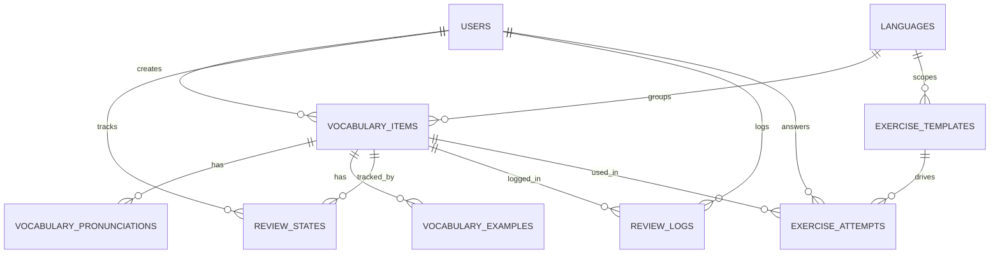

# Final ERD - Multilingual Vocabulary App

Tai lieu nay la ban **ERD cuoi cung** cho app hoc tu vung da ngon ngu, toi uu cho pham vi:

- English
- German
- Japanese
- tuong lai co the them Chinese

Huong thiet ke nay uu tien:

- schema gon
- dung chung toi da
- khong tách bang qua nho
- van du suc chua quiz va SRS cho nhieu ngon ngu

---

## 1. ERD tong quan



---

## 2. Nguyen tac thiet ke

Day la app hoc **tu vung**, nen schema chi can gom cac khoi sau:

1. Nguoi dung
2. Ngon ngu
3. Tu vung
4. Phat am / cach doc
5. Vi du
6. Trang thai hoc SRS
7. Lich su on tap
8. Quiz template
9. Quiz attempt

Khong can tach bang rieng cho:

- English words
- German words
- Japanese words

Thay vao do, moi tu deu nam trong `vocabulary_items`, va khac biet nho theo ngon ngu se duoc dat trong:

- `vocabulary_pronunciations`
- `metadata`
- `exercise_templates.config`

---

## 3. Mo ta chi tiet bang

## 3.1 `users`

Luu thong tin tai khoan nguoi dung.

### Vai tro

- xac dinh ai dang hoc
- quan ly du lieu so huu
- lien ket review state, review log, exercise attempt

### Fields

| Field | Type goi y | Rang buoc | Mo ta |
| :--- | :--- | :--- | :--- |
| `id` | bigserial | PK | ID nguoi dung |
| `email` | varchar | unique, not null | Email dang nhap |
| `password_hash` | varchar | not null | Mat khau da hash |
| `display_name` | varchar | not null | Ten hien thi |
| `role` | varchar | default `'user'` | Vai tro he thong |
| `created_at` | timestamp | not null | Thoi gian tao |
| `updated_at` | timestamp | not null | Thoi gian cap nhat |

### Ghi chu

Bang nay khong chua logic hoc tap, chi la identity va ownership.

---

## 3.2 `languages`

Danh muc ngon ngu duoc ho tro trong he thong.

### Vai tro

- phan loai tu vung theo ngon ngu
- xac dinh quiz nao dung cho ngon ngu nao

### Fields

| Field | Type goi y | Rang buoc | Mo ta |
| :--- | :--- | :--- | :--- |
| `id` | bigserial | PK | ID ngon ngu |
| `code` | varchar | unique, not null | Ma ngon ngu, vi du `en`, `de`, `ja`, `zh` |
| `name` | varchar | not null | Ten tieng Anh, vi du `English` |
| `native_name` | varchar | not null | Ten ban dia, vi du `Deutsch`, `日本語` |
| `family_type` | varchar | not null | Nhom ngon ngu, vi du `alphabet`, `cjk` |
| `is_active` | boolean | default true | Co dang hoat dong hay khong |
| `created_at` | timestamp | not null | Thoi gian tao |
| `updated_at` | timestamp | not null | Thoi gian cap nhat |

### Ghi chu

`family_type` huu ich neu sau nay muon nhom quiz theo loai ngon ngu.

---

## 3.3 `vocabulary_items`

Bang trung tam cua toan bo he thong hoc tu vung.

### Vai tro

Moi dong la mot don vi hoc, thuong la:

- mot tu
- mot cum tu
- mot bieu thuc co dinh

### Fields

| Field | Type goi y | Rang buoc | Mo ta |
| :--- | :--- | :--- | :--- |
| `id` | bigserial | PK | ID tu vung |
| `language_id` | bigint | FK, not null | Thuoc ngon ngu nao |
| `created_by_user_id` | bigint | FK, not null | Do user nao tao |
| `text` | varchar | not null | Mat chu chinh cua tu |
| `base_text` | varchar | nullable | Dang goc neu can |
| `part_of_speech` | varchar | nullable | Tu loai, vi du noun, verb, adjective |
| `meaning` | text | not null | Nghia chinh |
| `notes` | text | nullable | Ghi chu bo sung |
| `level_label` | varchar | nullable | Muc do, vi du A1, N5 |
| `is_active` | boolean | default true | Co dang hoc / hien thi khong |
| `metadata` | jsonb | nullable | Khac biet nho theo ngon ngu |
| `created_at` | timestamp | not null | Thoi gian tao |
| `updated_at` | timestamp | not null | Thoi gian cap nhat |

### Ghi chu

`metadata` co the luu:

- German: `article`, `plural_form`
- Japanese: `kanji_note`
- Chinese: `traditional_text`

Nhung neu mot field can query rat nhieu sau nay, khi do moi can tach rieng.

---

## 3.4 `vocabulary_pronunciations`

Bang luu phat am / cach doc cua tu.

### Vai tro

Bang nay rat quan trong vi no giup dung chung cho:

- English IPA
- German IPA
- Japanese hiragana
- Japanese romaji
- Chinese pinyin

### Fields

| Field | Type goi y | Rang buoc | Mo ta |
| :--- | :--- | :--- | :--- |
| `id` | bigserial | PK | ID pronunciation |
| `vocabulary_item_id` | bigint | FK, not null | Thuoc tu nao |
| `pronunciation_type` | varchar | not null | Loai pronunciation |
| `pronunciation_text` | text | not null | Noi dung pronunciation |
| `is_primary` | boolean | default false | Co phai pronunciation chinh khong |
| `created_at` | timestamp | not null | Thoi gian tao |
| `updated_at` | timestamp | not null | Thoi gian cap nhat |

### Gia tri `pronunciation_type` goi y

- `ipa`
- `hiragana`
- `romaji`
- `pinyin`
- `phonetic_note`

### Ghi chu

Vi du voi Japanese:

- `食べる` co the co `hiragana = たべる`
- va `romaji = taberu`

---

## 3.5 `vocabulary_examples`

Bang luu mau cau vi du cua tung tu.

### Vai tro

- hien thi ngu canh
- sinh bai `fillInBlank`
- sinh bai `multipleSentence`

### Fields

| Field | Type goi y | Rang buoc | Mo ta |
| :--- | :--- | :--- | :--- |
| `id` | bigserial | PK | ID vi du |
| `vocabulary_item_id` | bigint | FK, not null | Thuoc tu nao |
| `example_text` | text | not null | Cau vi du goc |
| `example_translation` | text | nullable | Dich nghia cau |
| `example_pronunciation` | text | nullable | Cach doc cau neu can |
| `sort_order` | integer | default 0 | Thu tu hien thi |
| `created_at` | timestamp | not null | Thoi gian tao |
| `updated_at` | timestamp | not null | Thoi gian cap nhat |

### Ghi chu

`example_pronunciation` rat huu ich cho Japanese va Chinese, nhung khong bat buoc voi English.

---

## 3.6 `review_states`

Bang luu **trang thai hoc hien tai** cua moi user doi voi moi tu.

### Vai tro

- SRS state hien tai
- xac dinh tu nao den han on
- luu thong tin nho / quen cua tung tu

### Fields

| Field | Type goi y | Rang buoc | Mo ta |
| :--- | :--- | :--- | :--- |
| `id` | bigserial | PK | ID review state |
| `user_id` | bigint | FK, not null | User dang hoc |
| `vocabulary_item_id` | bigint | FK, not null | Tu dang duoc hoc |
| `srs_level` | integer | default 0 | Muc SRS hien tai |
| `lapses` | integer | default 0 | So lan quen |
| `streak` | integer | default 0 | So lan dung lien tiep |
| `last_reviewed_at` | timestamp | nullable | Lan on gan nhat |
| `next_review_at` | timestamp | nullable | Lan on tiep theo |
| `is_learning` | boolean | default true | Co dang theo hoc tu nay khong |
| `created_at` | timestamp | not null | Thoi gian tao |
| `updated_at` | timestamp | not null | Thoi gian cap nhat |

### Rang buoc quan trong

- `unique(user_id, vocabulary_item_id)`

### Ghi chu

Bang nay la current state, khac voi `review_logs` la bang lich su.

---

## 3.7 `review_logs`

Bang luu lich su on tap chi tiet.

### Vai tro

- biet user da lam quiz gi
- dung de thong ke
- dung de debug SRS
- co the sinh analytics sau nay

### Fields

| Field | Type goi y | Rang buoc | Mo ta |
| :--- | :--- | :--- | :--- |
| `id` | bigserial | PK | ID log |
| `user_id` | bigint | FK, not null | User da lam bai |
| `vocabulary_item_id` | bigint | FK, not null | Tu duoc on |
| `exercise_type` | varchar | not null | Loai bai da lam |
| `result` | varchar | not null | Ket qua, vi du `correct`, `wrong`, `partial` |
| `reviewed_at` | timestamp | not null | Thoi diem review |
| `response_time_ms` | integer | nullable | Thoi gian phan hoi |
| `created_at` | timestamp | not null | Thoi gian tao log |

### Ghi chu

Neu can, co the them sau:

- `scheduled_at`
- `difficulty_score`
- `old_srs_level`
- `new_srs_level`

Nhung voi phase hien tai, chua can.

---

## 3.8 `exercise_templates`

Bang dinh nghia cac loai quiz.

### Vai tro

Thay vi hard-code toan bo quiz trong code, bang nay cho phep:

- quiz dung chung cho moi ngon ngu
- quiz rieng cho tung ngon ngu
- cau hinh cach sinh bai bang `config`

### Fields

| Field | Type goi y | Rang buoc | Mo ta |
| :--- | :--- | :--- | :--- |
| `id` | bigserial | PK | ID template |
| `language_id` | bigint | FK, nullable | Null neu la quiz chung, co gia tri neu quiz rieng cho ngon ngu |
| `exercise_type` | varchar | not null | Ten loai bai |
| `name` | varchar | not null | Ten hien thi |
| `prompt_mode` | varchar | not null | Cach dua de bai |
| `answer_mode` | varchar | not null | Cach user tra loi |
| `config` | jsonb | nullable | Rule sinh bai |
| `is_active` | boolean | default true | Con duoc su dung khong |
| `created_at` | timestamp | not null | Thoi gian tao |
| `updated_at` | timestamp | not null | Thoi gian cap nhat |

### Gia tri `exercise_type` goi y

Core:

- `multiple`
- `multiple_reverse`
- `fillInBlank`
- `multipleSentence`
- `voicePractice`

Language-specific:

- `ReadingHiraganaPractice`
- `TypingRomajiPractice`
- `articleChoice`
- `pluralChoice`
- `spelling`
- `pinyinReadingPractice`

### Gia tri `prompt_mode` goi y

- `word`
- `meaning`
- `sentence`
- `audio`
- `reading`
- `grammar_hint`

### Gia tri `answer_mode` goi y

- `choose_meaning`
- `choose_word`
- `choose_reading`
- `type_word`
- `type_reading`
- `type_article`
- `speak_word`

### Ghi chu

`config` vi du:

```json
{
  "distractor_count": 4,
  "pronunciation_type": "hiragana",
  "uses_examples": true
}
```

---

## 3.9 `exercise_attempts`

Bang luu moi lan user thuc su lam mot bai quiz.

### Vai tro

- luu prompt thuc te da dua ra
- luu cau tra loi cua user
- luu dap an dung
- luu dung / sai

### Fields

| Field | Type goi y | Rang buoc | Mo ta |
| :--- | :--- | :--- | :--- |
| `id` | bigserial | PK | ID attempt |
| `user_id` | bigint | FK, not null | User da lam bai |
| `vocabulary_item_id` | bigint | FK, not null | Tu duoc hoi |
| `exercise_template_id` | bigint | FK, not null | Template quiz duoc dung |
| `prompt_text` | text | not null | Noi dung prompt luc choi |
| `user_answer` | text | nullable | Cau tra loi cua user |
| `correct_answer` | text | nullable | Dap an dung |
| `is_correct` | boolean | not null | User tra loi dung hay khong |
| `created_at` | timestamp | not null | Thoi gian tao attempt |

### Ghi chu

Bang nay khac `review_logs`:

- `exercise_attempts` tap trung vao input/output cua quiz
- `review_logs` tap trung vao log hoc tap tong quat

Neu muon gon hon, ve ly thuyet co the gop 2 bang. Nhung tach ra se sach hon cho analytics va audit.

---

## 4. Mapping cho tung ngon ngu

## English

Can:

- `vocabulary_items`
- `vocabulary_pronunciations` voi `ipa`
- `vocabulary_examples`
- core quiz types

Co the them trong `metadata`:

- irregular forms

## German

Can:

- `vocabulary_items`
- `vocabulary_pronunciations` voi `ipa`
- `vocabulary_examples`
- core quiz types

Them trong `metadata`:

- `article`
- `plural_form`

Them template quiz rieng:

- `articleChoice`
- `pluralChoice`

## Japanese

Can:

- `vocabulary_items`
- `vocabulary_pronunciations` voi `hiragana`, `romaji`
- `vocabulary_examples`
- core quiz types

Them template quiz rieng:

- `ReadingHiraganaPractice`
- `TypingRomajiPractice`

Tuong lai Chinese:

- them `pinyin` vao `vocabulary_pronunciations`
- them `pinyinReadingPractice` vao `exercise_templates`

---

## 5. Index goi y

Nen tao index toi thieu:

- `languages(code)` unique
- `vocabulary_items(language_id, text)`
- `vocabulary_pronunciations(vocabulary_item_id, pronunciation_type)`
- `vocabulary_examples(vocabulary_item_id, sort_order)`
- `review_states(user_id, next_review_at)`
- `review_logs(user_id, reviewed_at desc)`
- `exercise_templates(language_id, exercise_type)`
- `exercise_attempts(user_id, created_at desc)`

---

## 6. Ket luan

Day la phien ban ERD cuoi cung hop ly nhat cho bai toan hien tai vi:

- khong qua phuc tap
- khong bi nhan doi bang theo ngon ngu
- dap ung duoc English, German, Japanese
- de them Chinese sau nay
- dung du cho quiz hien tai va quiz mo rong sau nay

Neu chot theo ban nay, thi day la schema nen duoc dung lam moc cho migration PostgreSQL moi.
